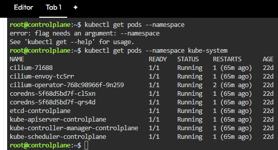

# Overview 
Kubernetes (K8s) provides `kubectl`, a main command line interface (CLI) tool for running commands and managing Kubernetes clusters using the Kubernetes API server. These commands help with deploying an application, troubleshooting a problem, and checking the status of a container. 
This document is a quick reference guide for the following `kubectl` commands used in troubleshooting Kubernetes containers. 

> [!NOTE]
> It is recommended you use these commands in the following order when debugging workloads. 

* `kubectl get pods`: View pod status.
* `kubectl logs`: Retrieve and review logs for a container in a pod.
* `kubectl exec`: Execute a command to open an interactive session inside the container.
* `kubectl debug`: Clone a pod with the same environment without changing the original container and use advanced debug options when a container is in a CrashLoopBackOff state. 
 
## Assumptions
* If you are new to Kubernetes, it is highly recommended that you learn about basic kubectl commands and the relationships between concepts before you proceed with troubleshooting an active container.

* As an experienced user of Kubernetes, it is assumed you have a valid context to the desired `kubectl` command and permissions to view resources in the namespace you want to inspect. It is also assumed that you have access to the cluster where the workload runs. 

> [!NOTE]
> Confirm you have the correct namespace before you troubleshoot.

## Commonly-used `kubectl` commands
This section provides a list of commonly-used `kubectl` instructions that enable new and experienced users to perform basic tasks like viewing pod status in a namespace, review container logs, inspect the container environment, and the option to use advanced debug tools. 

Before you dive into the commands, it is important to understand the three foundational concepts in Kubernetes:

* **Pod**: A pod is the smallest Kubernetes object and represents a set of running containers on your cluster.
* **Namespace**: An abstraction used by Kubernetes to support isolation of groups of API resources within a single cluster.
* **Node**: A node is a physical or a virtual machine in a cluster that runs workloads.

For a detailed list of Kubernetes terms and definitions, refer to the [Kubernetes Glossary](https://kubernetes.io/docs/reference/glossary/?fundamental=true)

### View Pod Status
Use the `kubectl get pods` instruction to view pods. Ensure you specify the namespace to identify workloads that are healthy or those thay may need attention. 

**Examples** 

To list pods in a specific namespace, use 

```bash
kubectl get pods --namespace <namespace-name>
```

To list all pods, use the following command
```bash
kubectl get pods --all-namespaces
```
> [!NOTE]
> If you omit the namespace, the `kubectl get` command displays an error or defaults to the namespace that is set to the current context.



**Expected output**

The output of the `kubectl get pods` command displays the name, readiness, current status, restart. and age amongst other fields. 

> [!NOTE]
> If no pods exist in the namespace, you will see an error message indicating no namespaces were found.

**Useful links**
* For a comprehensive list of `kubectl get commands`, refer to [kubectl_get](https://kubernetes.io/docs/reference/kubectl/generated/kubectl_get/)

* For detailed documentation on Pods, refer to [Pods](https://kubernetes.io/docs/concepts/workloads/pods/)

### 


References
* For more detailed information about installing and using `kubectl`, refer to the [`kubectl`documentation](https://kubernetes.io/docs/reference/kubectl/).
* [Kubernetes Glossary](https://kubernetes.io/docs/reference/glossary/?fundamental=true)
* [kubectl_get](https://kubernetes.io/docs/reference/kubectl/generated/kubectl_get/)


# Feedback
Was this page helpful? 


